# 🚀 PrepAI – AI Interview Preparation Platform

PrepAI is an AI-powered interview preparation platform that helps students and job seekers practice technical interviews with personalized AI-generated questions and detailed feedback.

The application simulates real interview sessions, evaluates answers using AI, generates improvement suggestions, and provides a professional dashboard to track interview performance.

---

## ✨ Features

### 🔐 Authentication
- User Signup & Login
- Secure authentication using Auth.js (NextAuth)
- Protected routes

### 🤖 AI Interview Simulation
- AI-generated interview questions
- Supports multiple roles
- Multiple difficulty levels
- Company-specific interview preparation
- Timer-based interview experience
- Autocomplete suggestions for skills & target company while configuring a session
- Quick presets — one-tap launch into a pre-configured interview

### 📊 AI Feedback
- Overall interview score
- Technical knowledge evaluation
- Communication analysis
- Confidence assessment
- Problem-solving evaluation
- Strengths & weaknesses
- Question-wise feedback
- Personalized learning roadmap
- Placement readiness prediction

### 📄 PDF Report
- Generate downloadable interview reports
- Professional report layout with score ring, competency breakdown, strengths/improvements and a personalized roadmap
- Accurate recommendation badges, duration and skills sourced directly from interview data

### 📈 Dashboard
- Overall AI score
- Total interviews completed
- Favorite role
- Recent interview history

### 👤 Profile
- Manage profile information
- Experience level
- Preferred role
- Target company
- Skills

### 📚 Interview History
- View all previous interviews
- Review previous AI feedback
- Access reports anytime

### 🆘 Support
- Users can raise support requests
- Track request status

### 🛡️ Admin Panel
- Admin analytics dashboard with real computed metrics (weekly activity, top roles, completion rate, avg. session length)
- User management (search, view, manage accounts, role-based access)
- Interview oversight (search, view, review any user's interview)
- Support ticket management (view & respond to user requests)
- Separate admin layout & navigation

### 🎨 Modern UI
- Complete dark violet UI redesign with a JetBrains Mono, terminal-inspired aesthetic
- Fully responsive UI — fluid-width layouts that adapt to every screen, from mobile to ultra-wide displays
- Skeleton loading screens
- Animated loading states
- AI Assistant toast notifications
- Consistent SVG icon set (lucide-react) throughout the app
- Role-based navigation (Admin link only visible to admin accounts)

---

# 🛠 Tech Stack

### Frontend
- Next.js 16
- React 19
- Tailwind CSS v4
- lucide-react (icon set)
- JetBrains Mono (UI typeface)

### Backend
- Next.js API Routes
- MongoDB Atlas
- Mongoose

### Authentication
- Auth.js (NextAuth)

### AI
- Google Gemini API

### PDF Generation
- jsPDF + html2canvas

---

## 📷 Screenshots

#### Landing Page
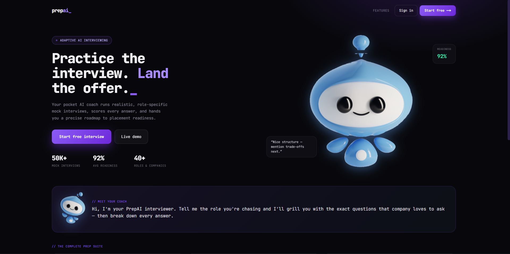
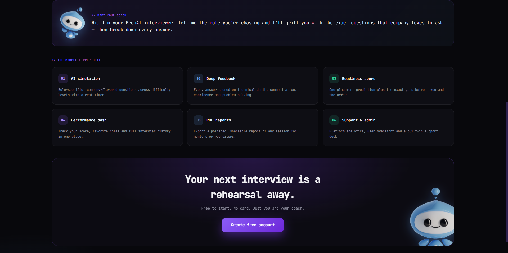

#### Register & Login
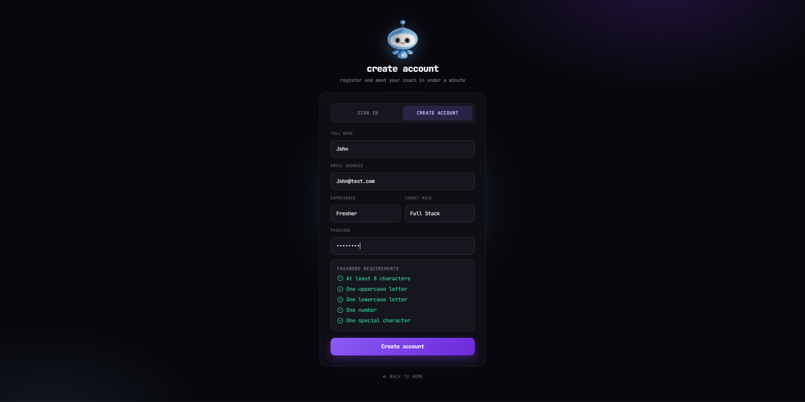
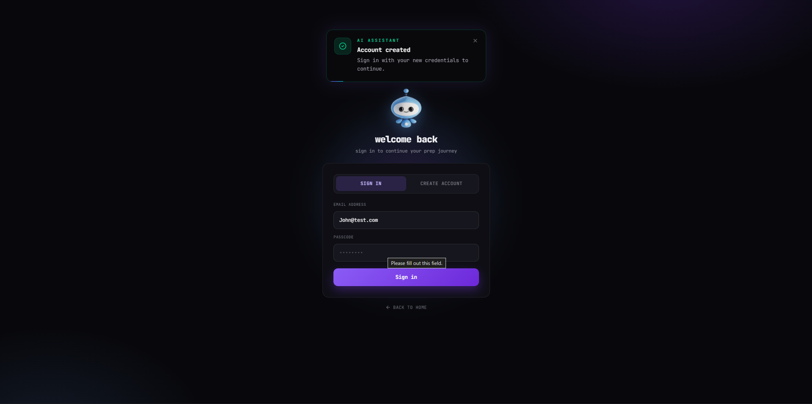

#### Dashboard
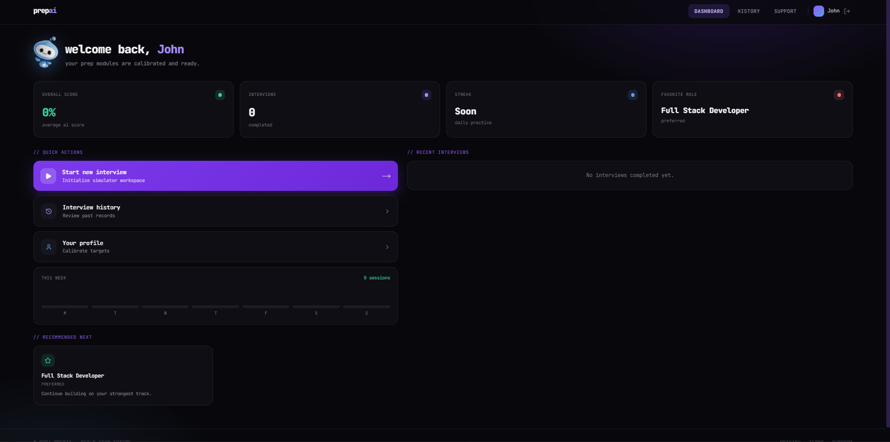

#### Interview Setup
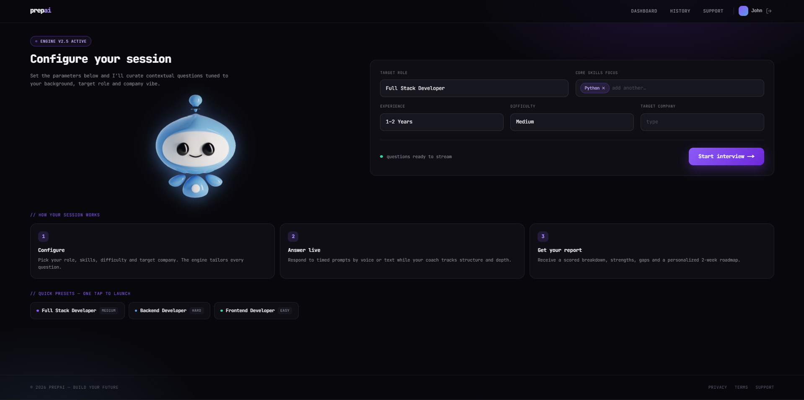

#### Loading Screen
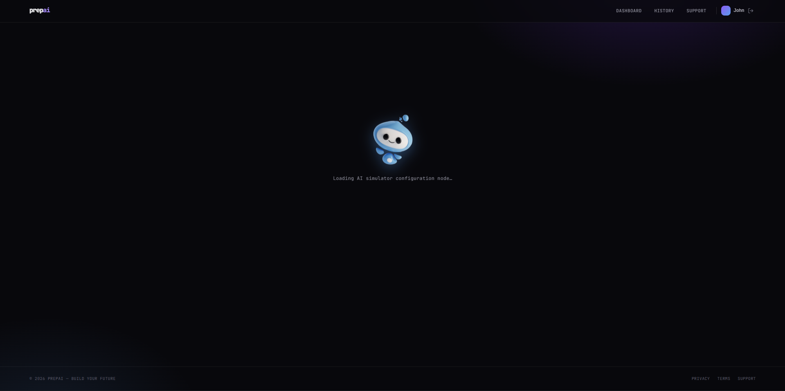

#### Interview Session
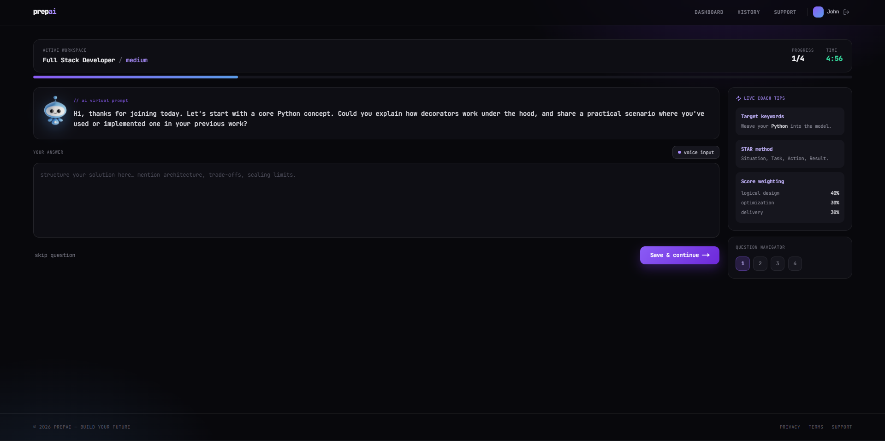

#### Feedback Report
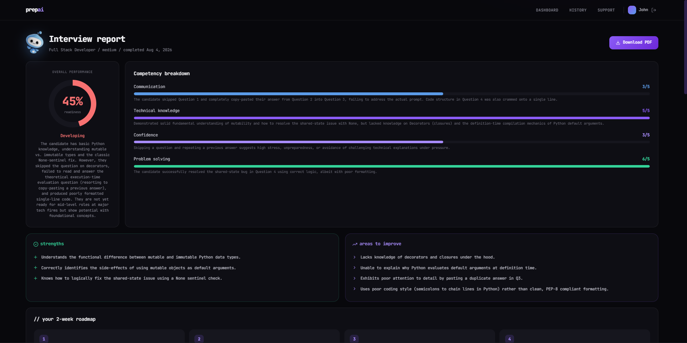
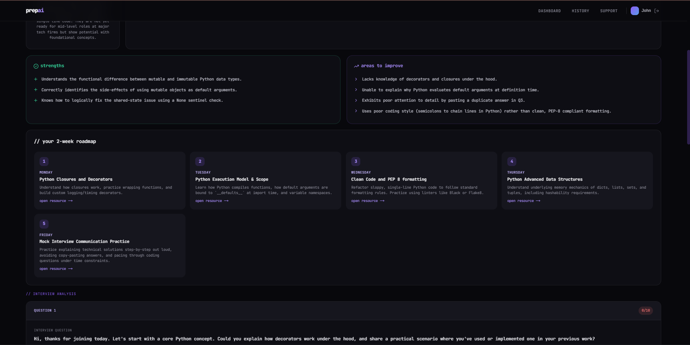
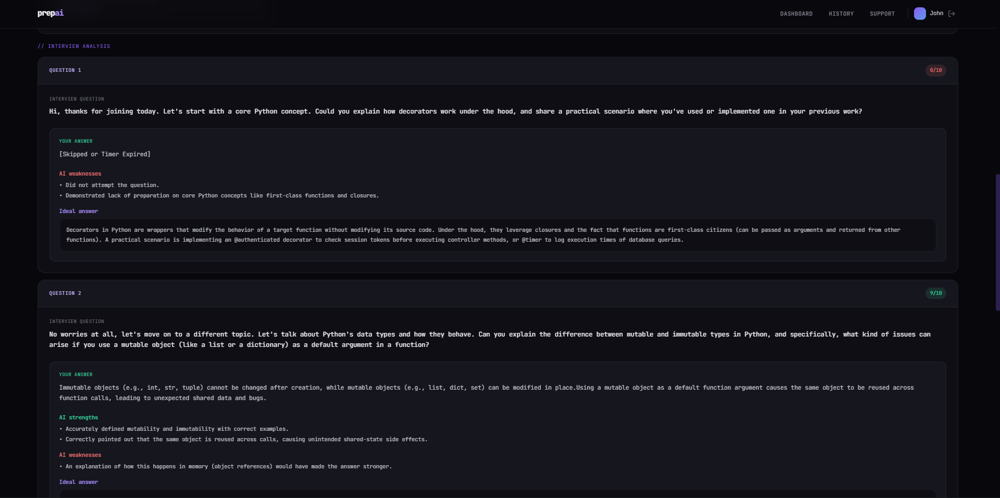

#### Interview History
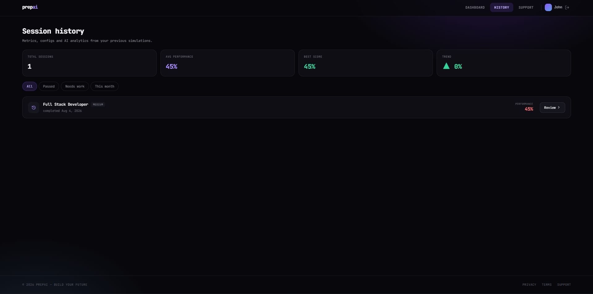

#### Support
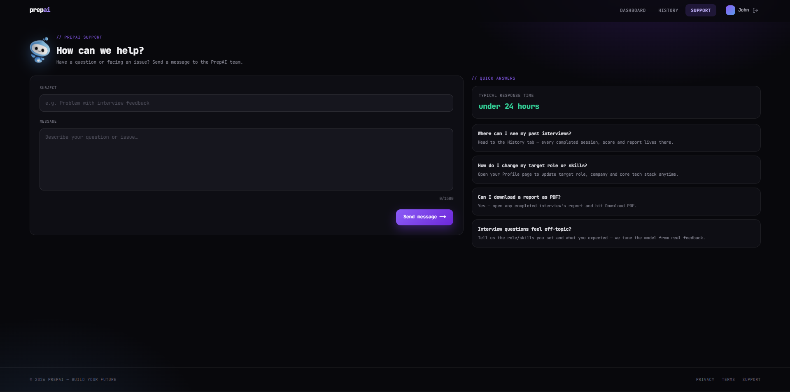

#### Profile
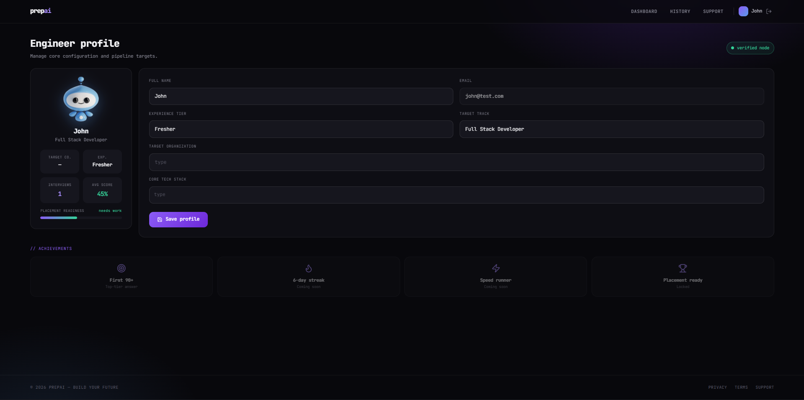

#### Admin Dashboard
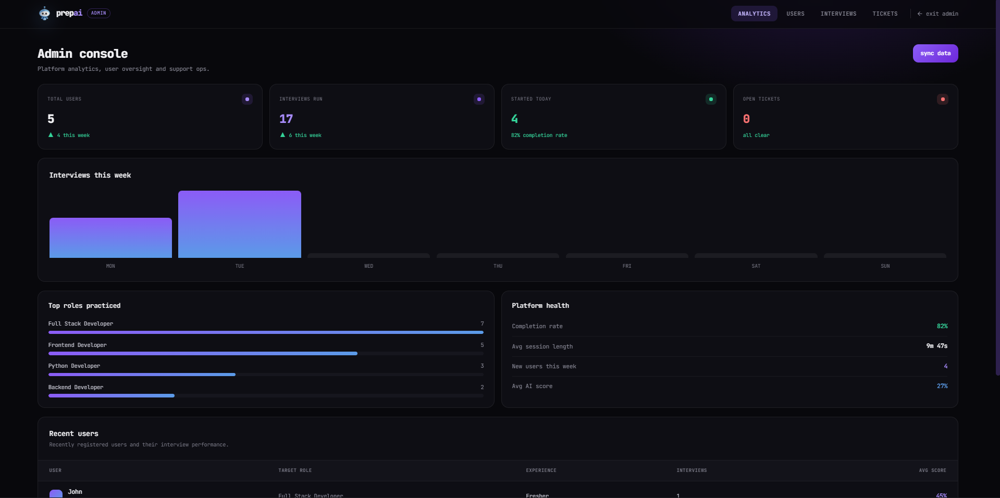
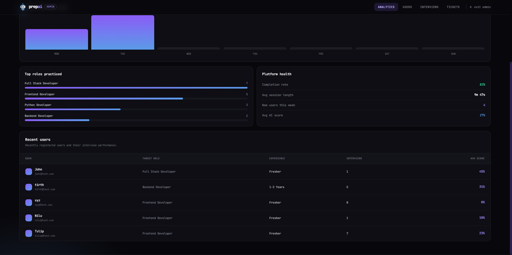

#### User Management
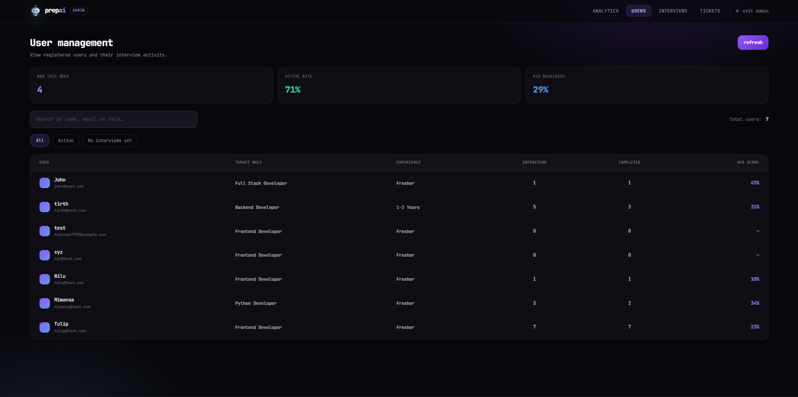

#### Interview Management
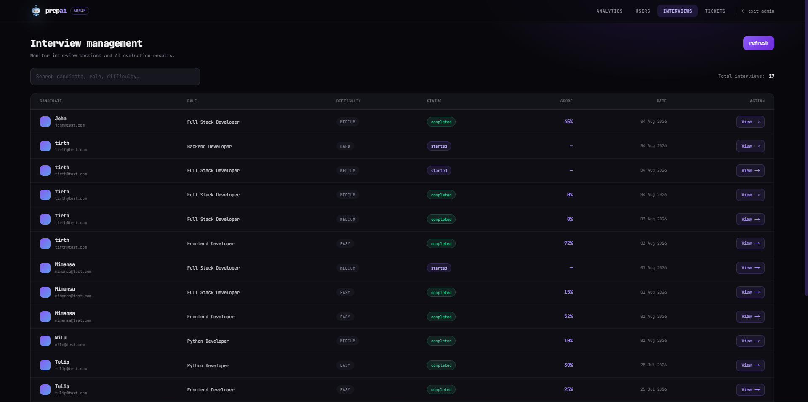

#### Support Tickets
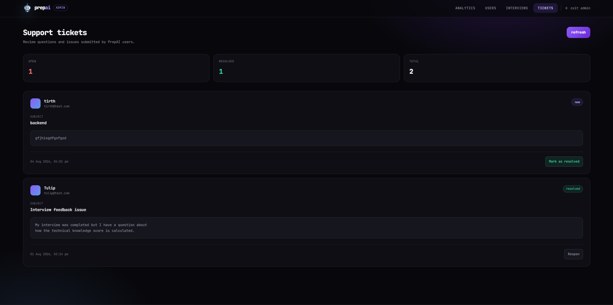

---

# ⚙️ Installation

Clone the repository

```bash
git clone https://github.com/MimansaPatle/PrepAI.git
```

Move into the project

```bash
cd PrepAI
```

Install dependencies

```bash
npm install
```

Create a `.env.local` file

```env
MONGODB_URI=YOUR_MONGODB_URI

AUTH_SECRET=YOUR_SECRET

AUTH_URL=http://localhost:3000

GEMINI_API_KEY=YOUR_GEMINI_API_KEY
```

Run the project

```bash
npm run dev
```

---

# 📂 Project Structure

```
app/
components/
controllers/
lib/
models/
services/
public/
```

---

# 🚀 Future Improvements

- Advanced Interview Analytics
- AI Voice Interviews
- Leaderboard
- Email Reports
- Interview Sharing
- Multi-language Support

---

# 👩‍💻 Developers

| Name | Role | GitHub | LinkedIn |
|---|---|---|---|
| **Mimansa Patle** | Backend Developer | [MimansaPatle](https://github.com/MimansaPatle) | [mimansapatle](https://www.linkedin.com/in/mimansa-patle-b489a6309) |
| **Tirth Vaghela** | Frontend Developer | [Tirthvaghela](https://github.com/Tirthvaghela) | [tirthvaghela](https://www.linkedin.com/in/tirthvaghela) |

---

⭐ If you like this project, consider giving it a star!
